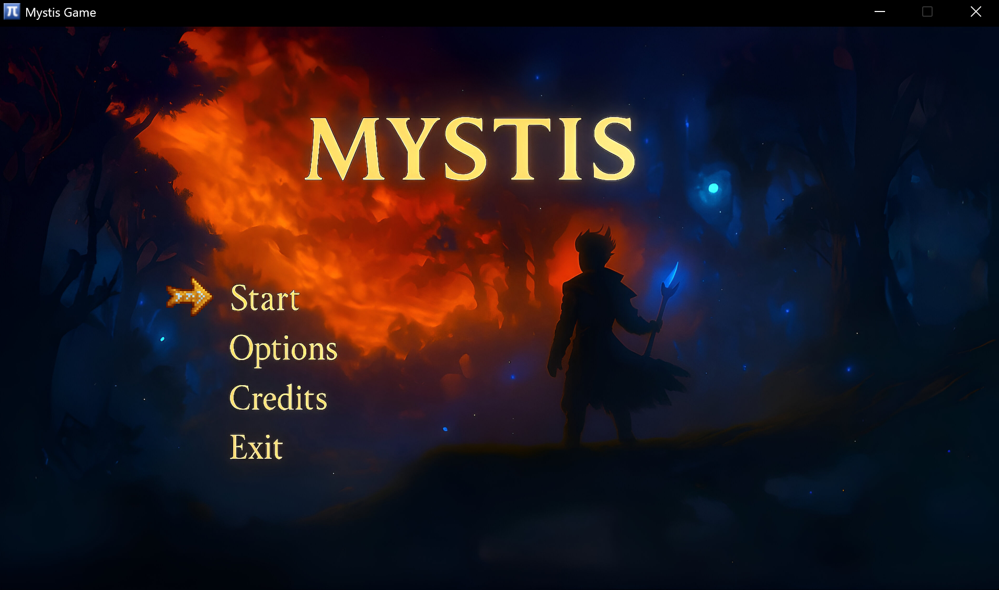
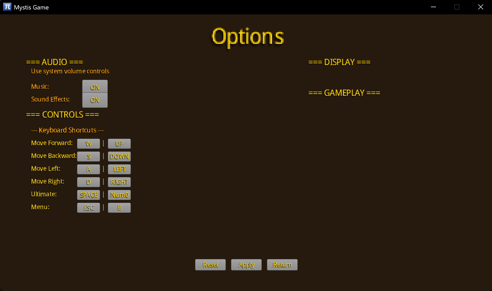
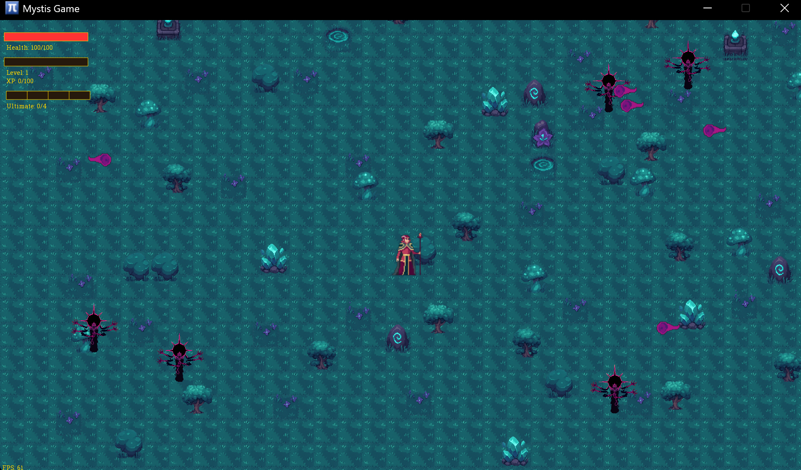
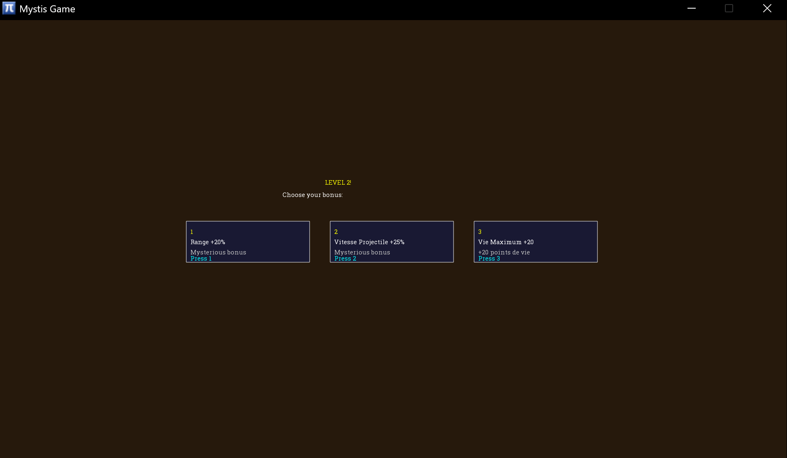

# Projet de Jeu 2D - GDX2D

## Description

Ce projet est un jeu 2D développé avec la librairie **GDX2D**, combinant animation, combat contre des ennemis, gestion de projectiles et système de bonus.

Le projet a été réalisé en groupe dans le cadre du cours 101.2 Programmation Orientée Objets, un jeu vidéo, avec une répartition des tâches autour de la logique de jeu, de l'animation, des collisions, et de l'interface utilisateur.

---

## Interface utilisateur

### Menu principal

### Menu des options

### Gameplay

### Choix du bonus

---

## Démonstration vidéo

> *Vidéo illustrant le gameplay, les ennemis, les animations et l'interface utilisateur.*

[gameplay.mp4](video/gameplay.mp4)

---

## Fonctionnalités principales

- Apparition dynamique des ennemis
- Animations : déplacement, attaque, mort
- Projectiles avec détection de collision
- IA simple : poursuite du joueur
- Bonus et améliorations à choisir pendant le jeu
- Menu principal, pause et options interactives
- Gestion du son et du volume (musique et effets)

---

## Problèmes rencontrés

- Certaines **animations de mort** ne se déclenchent pas toujours correctement, notamment pour le héros.
- Quelques ajustements de collisions et transitions restent à peaufiner.

---

## Propositions d'améliorations

- Agrandir la carte pour améliorer l'exploration.
- Implémenter plus de types d'ennemis et de bonus.
- Optimiser les animations pour une meilleure fluidité.
- Améliorer la collaboration et la gestion de projet pour une répartition des tâches plus équilibrée.

---

## Utilisation de ChatGPT

Nous avons utilisé **ChatGPT** lors de phases de blocage ou pour valider certaines approches techniques. Cela nous a permis de débloquer des problèmes de logique, de clarifier certains comportements inattendus, et d'optimiser notre code plus rapidement. Nous avons également utilisé ChatGPT pour traduire le rapport.

---

## Guide d'installation

### Pré-requis
- Scala SDK 2.13.14 minimum
- IDE IntelliJ

### Étapes
**Cloner le projet** :
- File -> New -> Project from Version Control -> https://github.com/Vchobu/Mystis
- Configuration du SDK Scala --> Scala SDK 2.13.14 minimum
- Installer toutes les dépendances dans le dossier lib --> "libs" --> Add as Library
- Exécuter MystisUniversApp.scala
